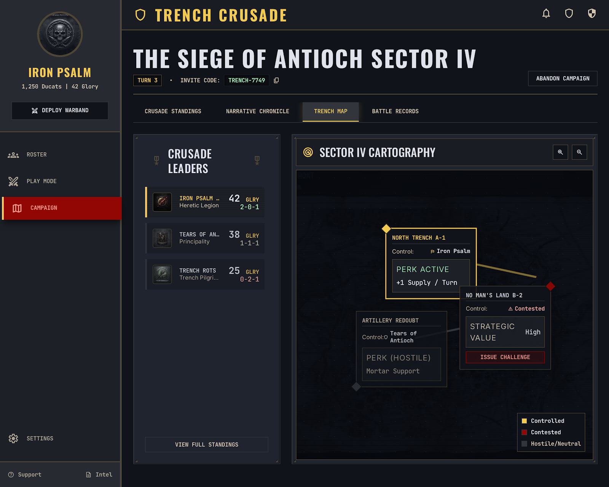

# TrenchLine

> A warband builder, tabletop combat companion, and campaign manager for
> **Trench Crusade** — a purpose-built alternative to
> [NewRecruit](https://www.newrecruit.eu/app/MySystems) for one game system,
> with the campaign tooling built in.



## Status

The app is functional and the feature set is broad, but it is mid-restructure.
An August 2026 audit found that the game data shipped by the original build was
largely invented and that the mobile/tablet layouts are unusable.

**Read [`docs/AUDIT.md`](docs/AUDIT.md) before trusting any number the app shows
you**, and [`docs/RESTRUCTURE-PLAN.md`](docs/RESTRUCTURE-PLAN.md) for where it is
going.

## Features

- **Warband Roster Builder** — all official factions, Ducat budgeting, equipment
  slots, printable dossiers.
- **Tabletop Play Mode** — wound steppers, Blood Marker pool, status tracking,
  keyword popovers, D6/2D6/D66 roller.
- **Campaign Hub** — leaderboard, shared invite codes, chronicle feed,
  territory map with node claiming.
- **Post-Battle Sequence** — D66 casualty and injury rolls, XP and stat
  advancement, No Man's Land exploration.
- **Codex** — scenarios with maps, keyword reference, armoury tables.
- **Rules Customizer** — local overrides and a diff view against upstream data.

## Quick start

```bash
npm install
cp .env.example .env        # DATABASE_URL, NEXTAUTH_SECRET
npx prisma migrate dev
npm run dev
```

Requires Node 18+ and PostgreSQL.

## Tech stack

| Layer | Choice |
|---|---|
| Framework | **Next.js 15 (App Router)**, React 19, TypeScript 5.7 |
| Styling | Tailwind CSS + CSS custom properties for per-faction themes |
| Client state | Zustand, persisted to `localStorage` |
| Database | Prisma + PostgreSQL |
| Auth | NextAuth (credentials provider) |
| Game data | Generated from BattleScribe catalogues — see below |

See [`docs/ARCHITECTURE.md`](docs/ARCHITECTURE.md) for the full picture.

## Game data

TrenchLine does not hand-write game data. Everything is derived from sources in
[`data-sources/`](data-sources/) by a checked-in pipeline, and every value
carries provenance.

Three sources, layered:

1. **BattleScribe catalogues** ([`Fawkstrot11/TrenchCrusade`](https://github.com/Fawkstrot11/TrenchCrusade)) — the base, pinned by commit SHA. The same data NewRecruit uses.
2. **Official rulebooks** ([trenchcrusade.com/rules](https://www.trenchcrusade.com/rules/)) — cross-check and rules prose.
3. **Trench Dispatch** — the newest rules, applied as a patch layer on top.

Two rulesets ship:

| Ruleset | What it is |
|---|---|
| **Latest GitHub Rules** | The community catalogues exactly as published. Matches NewRecruit. |
| **TrenchLine Rules** *(default)* | The catalogues corrected against the rulebooks and brought up to date with the Trench Dispatch. |

```bash
npm run rules:fetch        # pull the catalogues at a pinned commit
npm run rules:crosscheck   # report drift between app data and the catalogues
npm run rules:extract      # PDF -> text for a rulebook or Dispatch
```

Full design in [`docs/RULESET-MODEL.md`](docs/RULESET-MODEL.md).

## Documentation

| Document | Covers |
|---|---|
| [`docs/AUDIT.md`](docs/AUDIT.md) | What is wrong today, with evidence |
| [`docs/RULESET-MODEL.md`](docs/RULESET-MODEL.md) | Data sourcing, layering, versioning, verification |
| [`docs/ARCHITECTURE.md`](docs/ARCHITECTURE.md) | Current and target application structure |
| [`docs/MOBILE.md`](docs/MOBILE.md) | Mobile/tablet standards and defects |
| [`docs/RESTRUCTURE-PLAN.md`](docs/RESTRUCTURE-PLAN.md) | Phased delivery plan |
| [`docs/DATA-SOURCES.md`](docs/DATA-SOURCES.md) | Where each source comes from |

## Contributing

Four rules, all of which the original build broke:

1. **No hand-written game data.** Generate it from `data-sources/` or don't ship it.
2. **No invented fallbacks.** Failures fail visibly. Never synthesise plausible data.
3. **Mobile-first.** Base styles target a 375px phone; desktop is the enhancement.
4. **Document decisions** in the same commit that makes them.

## License

Personal and community tool for the *Trench Crusade* wargame. Not affiliated
with or endorsed by Factory Fortress Inc.
