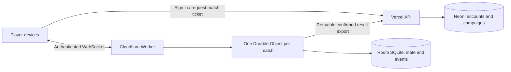

# Two-way live play: architecture brief and review round 1

Status: proposal for Codex / Claude discussion; no implementation decision or infrastructure purchase approved.
Author: Codex. Date: 6 September 2026.
Repository baseline: a486f2b029a8b674c813cb5b689866da285c4204.
Related: [existing live-mode plan](LIVE-MODE.md), [campaign sync](CAMPAIGN-SYNC.md), [deployment](DEPLOYMENT.md), [legal](LEGAL.md).

## 1. Recommendation and scope

Prototype **Cloudflare Workers with one SQLite-backed Durable Object per match**, retaining Vercel for the website/authentication and Neon for accounts, rosters and campaign records. Compare it against **Vercel + Neon + managed messaging** using the same small match engine and reconnect test.

The owner already uses Cloudflare for registration/DNS. That makes its administration familiar; it does not provide paid compute credits or mean Cloudflare already processes live game data. Registration, DNS/proxy plans and Workers billing are separate concerns. A paid website Pro plan is not the prerequisite proposed here.

### Owner clarification: three lasting Game Mode choices

The owner has told Claude that Game Mode should offer:
1. **Single Device** — the current local experience.
2. **GM / Game Master Mode** — one controlling device, other devices view.
3. **Live Play** (working name) — synchronised participant devices with shared authority.

Treat these as supported product modes, not a sequence in which Live Play replaces GM Mode. The initial mode picker should explain who controls the battle, who needs connectivity, and what viewers can see.

| Mode | Editing authority | Persistence and connectivity | Intended experience |
| --- | --- | --- | --- |
| Single Device | Local operator | Local save; usable offline | One phone runs the table |
| GM Mode | One GM controller at a time | Shared server match for viewers; controller recovery defined | Facilitated game with passive participant screens |
| Live Play | Participant seats, per action policy | Server-confirmed shared state | Each player operates their own side |

The current mirror is a useful starting point for GM Mode, not proof that complete GM Mode exists. It mirrors one named warband board. A full GM mode should describe all participating forces, scenario, objectives, scores, and round state, with a GM able to adjudicate across them. If private cards or objectives are supported, each viewer must receive only their allowed projection.

Recommended long-term shape: **one match engine, three authority/persistence adapters**. Single Device calls the engine locally. GM Mode and Live Play use the same remote command service, with different permissions. Reuse model cards, battle log and rules projection; do not maintain three independent combat implementations. Introduce this separation incrementally so local play is not forced to adopt cloud accounts.

GM is a match role, not the site's administrator role or automatically the campaign organiser. A second tab on the same GM account must not accidentally become a competing controller. Use an explicit controller session/lease and a fencing epoch for takeover. Viewers remain read-only even if they own one of the rosters.

For the first release, choose mode in the lobby and lock it at match start. Later switching GM Mode ↔ Live Play requires a pause, participant agreement where control changes, and an authority-epoch update that rejects commands from old controllers. Moving an offline local match into a shared mode also needs an explicit upload and privacy confirmation; reconnect alone must not perform it.

A Single Device match can remain entirely local. A server-based GM match should remain recoverable after the GM phone dies, even though the original mirror deliberately omitted handover. Recovery is a separate planned increment; it should not be implied by naming the existing mirror "GM Mode."

This recommendation is conditional: choose Cloudflare if a prototype demonstrates reliable recovery, acceptable Australian latency, affordable storage writes and a maintainable result-export boundary. Choose managed messaging if keeping all authoritative state in Neon proves substantially simpler for this team. Do not migrate the whole app to decide this.

Assumed product: physical miniatures, two players, separate phones, one shared battle. A virtual tabletop with coordinates, terrain, movement enforcement and line of sight is excluded. Initially assist human adjudication rather than promise complete rules automation. Physical dice remain supported. Four-player All Out War, spectators and shared digital dice are extensions, not prerequisites for a first usable battle.

## 2. What exists, and where Claude's plan needs refinement

LIVE-MODE.md proposes a host-only mirror followed by two-way editing. Its statement that nothing is built is stale: FEATURES.md records LIVE-1 as built, and the repository has LiveMatch in Prisma, api/campaigns/live, services/liveMatch.ts, useLiveMirror.ts, LiveMirrorPanel and tests. This brief is based on source inspection, not a claim that production was exercised.

The mirror carries a narrow board projection: turn, warband name, and model wounds/status/markers/activation. It is useful for learning how players use a second screen. Its wire format does not contain a complete shared battle.

PlayModeView still keeps scenario, deployed squads, scores, weather and active-player state in component state. The match slice mutates transient fields inside roster units. A shared match needs these game facts gathered into a separate durable aggregate; panel visibility, searches and selected tabs remain local UI state.

Four disagreements with the original plan:

1. Per-model ownership reduces collisions but does not settle opponent-spent markers, scoring, round transitions or shared decks. Define action-specific authority.
2. A snapshot protocol still needs ordering. The current live PUT ignores baseRevision and increments a revision on arrival; delayed older writes can receive higher revisions. Account ownership also does not enforce a single physical writer. Before treating the mirror as a foundation, add writer fencing/sequence handling and prevent overlapping stale writes.
3. Do not reuse the campaign conflict modal during combat, but do reuse sound concepts: action IDs, transactional persistence, prerequisite checks and recovery. Those concepts are not inherently slow.
4. Vercel now documents WebSocket support in beta. Its earlier inability to host sockets is no longer a valid elimination criterion [S3].

The owner has expressed a direct requirement for two-way play. Mirror feedback should refine the design, not indefinitely gate specification work.

## 3. Player experience and authority

### Lobby and starting

Create a standalone match or attach one to a campaign. Invite by expiring link/QR; a code grants the ability to request a seat, not unlimited access to a campaign. Initially require an account for an editing seat; GM viewers can use account-based access first, with guest viewing designed separately. Guest editing needs its own revocable identity and should be designed explicitly later.

Each player chooses a roster and deployed squad. Both inspect scenario, house rules, visibility and dice mode before Ready. Starting freezes roster snapshots and a ruleset manifest/hash, including selected layers and custom overrides. Preserve the exact required rule data or a retrievable immutable artifact, not merely a label such as "latest."

Edits to the roster elsewhere cannot alter an active match. Match unit IDs are scoped independently of a user's saved roster IDs.

### Phone layout

Three primary views: My force, Opponent, Battle log. Keep round, active side, scores and connection state in a compact persistent strip. Provide tablet split views as an enhancement. Follow MOBILE.md: reachable scrollable sheets, 44px controls, 16px inputs and dvh.

Routine changes should not demand opponent confirmation. Show a short recent-action feed and a persistent log. Make proposed, pending, confirmed and rejected actions distinguishable without relying on colour. Announce meaningful changes accessibly without reading every update aloud.

| Action | Proposed rule |
| --- | --- |
| Activation and routine own-model bookkeeping | Controlling participant, subject to match prerequisites |
| Spend opponent-model resource | Explicit permitted command; validate resource availability |
| Damage/status from a resolved attack | One resolution action identifies source/target; avoid two players independently applying the same damage |
| Manual correction | Named correction with actor/reason; agreement if it reverses a consequential shared result |
| Round advance | Ready states from participants, then one atomic advance/reset |
| Shared objective | Claim/resolve workflow agreed in lobby; competing claims cannot both succeed |
| Final result | Participant confirmation, followed by one campaign finalisation |
| Spectator | Read-only projection; never receives secret state |

These are product proposals, not assertions of published game rules. Derive actual constraints from the repository's source pipeline. Explicitly allow recorded house rulings where automation is incomplete.

### Randomness, private information and offline play

For server dice, generate and persist the result once under an action ID before showing it. Retrying cannot reroll. Physical dice entries are labelled as manual; software cannot prove tabletop honesty.

Private cards/objectives must be filtered on the server, including reconnect snapshots and historical events. Hiding data in React is insufficient.

On disconnect, preserve the confirmed board and show its age. Private notes can continue. Avoid accumulating contested shared actions that blindly replay later. Offer pause/resume first. A later single-device takeover needs a server-issued authority epoch that fences old writers; two disconnected phones cannot both guarantee a common truth.

Presence means "recently connected," not "player agrees" or "player forfeits." Handle screen lock, app switching and expired authentication as normal cases.

## 4. Common match protocol, independent of provider

Suggested aggregate:
- Match: ID, optional campaign ID, lifecycle, rules manifest, protocol version, revision.
- Participant: user/seat, role, roster snapshot, ready state.
- State: round/phase, models, scores, objectives, shared effects and server-only secrets.
- Action receipt/event: match ID, action ID, authenticated actor, payload hash, sequence, outcome, timestamp.
- Finalisation record: stable result ID, confirmed revision/hash, export status.

Lifecycle: lobby → active ↔ paused → awaiting confirmation → finalised; cancelled is explicit. Retain finalised results rather than making "end match" synonymous with deleting all state.

A command names intent and prerequisites. Example: spend a marker from a named target during a named activation. Avoid raw whole-board replacement and ambiguous toggle operations.

The authoritative service:
1. Verifies identity, membership, role, payload bounds and protocol.
2. Looks up the action receipt. Same ID and same actor/payload returns the original outcome; different content is rejected.
3. Checks relevant prerequisites against current state.
4. Atomically commits state, sequence and action receipt.
5. Acknowledges and sends the permitted event projection to participants.

Commands on independent models can be revalidated against current state without rejecting solely because the global revision changed. Noncommutative actions, such as spending the last marker or advancing a round, need exact prerequisites. For a small room, serialising accepted commands is easier to reason about than general CRDT merging.

Clients retain pending IDs until acknowledged, ignore duplicate sequences, detect gaps and request replay or a fresh snapshot. A disconnect after commit but before acknowledgement must not duplicate an action. Server acknowledgement means durable commit, not just receipt in memory.

An event log plus periodic snapshots supports recovery and corrections. Start with bounded replay and retention; do not promise indefinite event sourcing. Never silently replay historical events through a changed rules engine.

## 5. Architecture choices

| Choice | Durable authority | Delivery | Main benefit | Main cost/risk |
| --- | --- | --- | --- | --- |
| A. Cloudflare match rooms | Durable Object SQLite | Hibernating WebSockets | Match coordination and persistence are colocated | Two runtimes; explicit Neon export |
| B. Existing API + managed messaging | Neon transaction | Ably/Pusher-style channels | Keeps durable state in one database | Vendor billing and reliable publish pipeline |
| C. Native Vercel sockets | Neon, with shared coordination | Vercel WebSockets | Familiar hosting environment | Beta and expiring/distributed connections |
| D. Dedicated Node service | Postgres and/or room journal | WebSocket server | Full operational control | Patching, restart recovery, scaling and monitoring |
| E. HTTP commands + polling | Neon | Conditional GET | Smallest infrastructure change | Latency and recurring reads |
| F. Peer-to-peer WebRTC | Usually a chosen device | Data channels | Potentially direct device traffic | Signalling/TURN, host loss and trust |

E is a valid early two-way prototype: transport need not be bidirectional for the product to be. It still requires the same authoritative command protocol. F is not recommended for the first release: it removes neither identity nor reconnect/authority problems. D is viable if operational control is a priority, but adds maintenance for a hobby application.

### A. Cloudflare room service

Suggested boundary:

Use a dedicated live subdomain/Worker endpoint. The main site can remain on Vercel with its current DNS arrangement; routing all website traffic through Cloudflare is not required.

Vercel validates its existing session and issues a short-lived, narrowly scoped match ticket. Worker/room verifies signature, audience, expiry, seat and match. Prefer a dedicated asymmetric signing key so the Worker needs only the public verification key, rather than sharing NEXTAUTH_SECRET.

Do not put durable bearer credentials in URLs/logs. Authenticate the connection using a reviewed short-lived ticket exchange, enforce Origin, close unauthenticated connections promptly, and cap connection/message rates. Tickets need renewal; removed participants and revoked sessions need bounded revocation latency, with room notification for urgent removal. An already-open socket must not stay privileged forever.

SQLite holds the active match and receipts. Do not dual-write every turn to Neon. A DO is a coordination primitive, not permission to ignore async interleaving: commit state transitions transactionally, avoid external awaits in the mutation section, and reload durable state after restart/hibernation. Keep secrets out of broadcast projections.

On final confirmation, persist an export job in the same room transaction. Retry a signed server-to-server export to Vercel. Neon atomically inserts a unique result ID and applies rewards once. Lost responses are harmless retries. Show "battle complete; campaign update pending" if Neon is down. A reconciliation job finds stuck exports. Never delete room history until export acknowledgement and retention conditions hold.

Account deletion, campaign deletion and member removal must propagate across both stores. Prevent a delayed export from recreating deleted records. Decide how another player's retained battle history is anonymised, and document the lifecycle.

### B. Vercel + Neon + managed messaging

POST commands to an existing-style Next.js API. A Neon transaction writes state, receipt and an outbound notification record. A durable dispatcher retries publication. Browser subscribers use match-scoped short-lived tokens; clients cannot publish authoritative game state.

If publication fails, data remains committed and reconnect/polling repairs the gap. Provider delivery guarantees do not replace database action deduplication. This option has the simplest single-database story but needs an actual dispatcher, not unawaited work after an HTTP response.

Ably's current free package lists 6 million monthly messages, 200 simultaneous connections and 200 channels; it is positioned for experimentation [S4]. Count published and delivered messages according to the provider, including spectators and presence. Existing Vercel/Neon costs remain separate.

Supabase Realtime is another candidate, but do not assume it attaches transparently to Neon. Investigate a server-published Broadcast design versus database migration/replication before treating it as interchangeable. A database migration solely for messaging is not proposed.

### C. Vercel WebSockets

Current documentation allows sockets in beta on all plans. Connections terminate at function maximum duration; new connections can reach different instances or deployments. Persist state and coordinate cross-instance delivery externally [S3].

Treat socket handlers as a transport around the same command service. A process-local room map is not authoritative. Evaluate a shared broker/stream and its costs; otherwise two players can connect successfully yet never see each other's events. Test forced duration expiry and mixed old/new deployments. This option may become attractive after a measured prototype, but "already on Vercel" does not eliminate coordination work.

## 6. Can Cloudflare be free?

**Yes for a prototype, plausibly for modest play, subject to measured usage.** No paid subscription is required merely to use SQLite-backed Durable Objects.

Published Free allowances: 100,000 DO requests/day; 13,000 GB-seconds/day; 5 million SQLite rows read/day; 100,000 rows written/day; 5 GB total storage. Exceeding a free allowance makes affected operations fail; daily allowances reset at 00:00 UTC. Incoming socket messages have a 20:1 compute-billing ratio; outbound socket messages are uncharged. Hibernation avoids idle duration billing [S1].

Workers Paid starts at US$5/month plus usage. The front Worker has its own request/CPU limits; its Free allowance includes 100,000 requests/day and 10ms CPU per invocation [S2]. Registration fees and existing Vercel/Neon costs are separate. Prices are USD before any applicable taxes and may change.

### Illustrative workload, not a capacity promise

Assume a three-hour battle, two players plus one spectator, and 20 accepted actions/minute across the whole table:
- 3,600 commands per match.
- Roughly 10,800 event deliveries to three devices.
- At three logical row writes per action, roughly 10,800 writes/match before indexes, receipts design, alarms, cleanup and retries.
- Ten such matches/day produce roughly 108,000 logical writes: already a reason to investigate the write allowance, despite low connection counts.
- Two-second polling by two watchers instead produces 10,800 GETs/match, excluding host writes/lobby polls.
- As a deliberately pessimistic duration illustration, 10,800 seconds × 0.128 GB = 1,382.4 GB-s per continuously active room. Hibernation changes this substantially; measure actual active duration.

These are our arithmetic assumptions, not provider benchmarks. Message counts, billable requests, SQL rows and CPU are different meters. Measure each separately. Long-lived timers, frequent application heartbeats or external I/O can undermine an apparently cheap room design.

Prototype on Free with visible quota/error reporting. Before regular organised play, consider Paid for headroom rather than allow a daily quota to interrupt a club night. US$5 is an entry price, not a total-bill guarantee. Configure app limits and alerts; alerts are not a hard spend cap. Retention and telemetry also consume resources.

## 7. Security, operations and privacy requirements

- Separate preview/staging rooms, credentials and data from production.
- Rate-limit ticket creation, room creation, connections and commands; bound spectators, payloads and match lifetime.
- Authorise every command, including after reconnect; never trust client-supplied actor IDs.
- Keep short-lived connection state separate from durable readiness/consent.
- Track acknowledgement latency, rejected commands, sequence gaps, reconnect success, active rooms, SQL writes and pending exports.
- Target, provisionally, local tap feedback immediately and p95 remote confirmation under one second on representative Australian connections. Measure cold starts and phone wake separately.
- Pin protocol and rules versions per match. Deploy backward-compatible handlers and test an old client reconnecting after release.
- Test recovery from room restart and database restore; state the recovery-point limitation rather than imply zero loss.
- Expand privacy disclosures for Cloudflare's actual live-state processing and retention even though it is already named for DNS/email. Choose and document data placement; do not infer Australian-only storage from a Sydney user or function region.
- Keep the existing single-device/offline mode usable if the new service is unavailable. A service outage must not fabricate a synchronised match.

## 8. Delivery packages and acceptance gates

Planning estimates below are person-weeks for an experienced developer, including testing, not a calendar promise or an estimate of AI typing speed. Re-estimate after the spike.

| Package | Deliverable | Rough effort |
| --- | --- | --- |
| Specification | Authority table, lifecycle, phone flow, failure semantics | 1–2 weeks |
| Engine/protocol | Separate match aggregate, reducer, receipts, frozen rules | 2–3 weeks |
| Comparative spike | Cloudflare and managed-messaging vertical slices | 1–2 weeks |
| Two-player alpha | Lobby, squads, activations, markers, reconnect and corrections | 3–5 weeks |
| Completion/operations | Scores, result export, monitoring and real table trials | 2–4 weeks |

Order-of-magnitude total: 9–16 person-weeks, with overlap possible. Full rule adjudication, four-player All Out War and virtual-tabletop features are additional scope.

Release gates:
1. Two accounts complete a battle at 375×667 without unreachable controls.
2. Double submission and lost acknowledgements apply an action once.
3. Competing spends of one remaining resource cannot both succeed.
4. Delayed messages and reconnect never regress confirmed state.
5. Phone sleep, tab reload, room restart and deployment preserve the match.
6. Spectators/removed members cannot write or recover private state.
7. Repeated finalisation/export awards campaign outcomes once.
8. Quota exhaustion and vendor outage produce an honest recoverable state.
9. The cost model uses measured counters from representative matches.
10. Existing roster and offline play regression checks pass.

Suggested spike benchmark: 20 concurrent synthetic rooms, three connections each, 20 actions/minute/room, plus a burst case. Run in staging with spend controls. This is a proposed workload, not a claim that tests have run.

## 9. Claude review request and refinement record

Please review this as a proposal, not as authorisation to build or deploy. Respond with concrete disagreements and replacement designs.

1. Does the three-mode model above match your understanding, and what does GM Mode require beyond the existing mirror? Which state in PlayModeView, AllOutWarCardConsole and the store must move into the shared aggregate?
2. Is Cloudflare's room/Neon export split simpler than a Neon transaction plus messaging outbox for this codebase? Explain the failure path for each.
3. What action permissions are wrong or missing for actual Trench Crusade play? Cite source-derived rules where relevant.
4. What is the smallest complete two-player feature that would be worth using at a table?
5. Which offline actions can safely queue, and which must wait?
6. How should correction/undo work after another action depends on the result?
7. What concrete schema/index choice changes the write-cost estimate?
8. What would falsify the Cloudflare recommendation during the spike?
9. Are the effort ranges credible given existing tests and components?
10. What needs changing in LIVE-MODE.md and FEATURES.md once a decision is accepted?

Suggested response file: docs/LIVE-PLAY-CLAUDE-REVIEW.md, referring to this brief's numbered sections. Keep this round intact while reviewing. Round 2 can update the recommendation and add a decision table with: proposal, evidence, accepted/rejected/deferred, owner decision needed.

Confirmed owner direction: three modes—Single Device, GM Mode and Live Play. Unresolved owner choices: guests versus accounts; opponent-confirmed damage versus self-reporting; physical versus shared digital dice; standalone battles; spectator privacy; maximum player count; acceptable paid monthly budget. Proposed defaults are stated above so design work can continue.

## Sources and verification

Official provider pages checked 6 September 2026; verify again before purchase/deployment.

- S1: [Cloudflare Durable Objects pricing](https://developers.cloudflare.com/durable-objects/platform/pricing/).
- S2: [Cloudflare Workers pricing](https://developers.cloudflare.com/workers/platform/pricing/).
- S3: [Vercel WebSockets](https://vercel.com/docs/functions/websockets).
- S4: [Ably Free package](https://ably.com/docs/platform/pricing/free).
- [Cloudflare WebSocket hibernation](https://developers.cloudflare.com/durable-objects/best-practices/websockets/).
- [Ably scoped token authentication](https://ably.com/docs/auth/token).

Repository evidence: LIVE-MODE.md, FEATURES.md, DEPLOYMENT.md, ARCHITECTURE.md, prisma/schema.prisma, src/app/api/campaigns/live/route.ts, src/components/play/useLiveMirror.ts, src/services/liveMatch.ts, src/store/slices/match.ts and src/components/play/PlayModeView.tsx.

Validation of this deliverable: source and documentation review only. No prototype, benchmark, deployment, billing change or new production test was performed.
